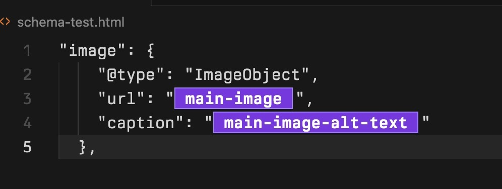

# Webflow CMS Binding Highlighter

VS Code / Cursor extension that **highlights Webflow `{{wf ...}}` CMS bindings** in HTML, JSON, and JSON-LD (for example inside `<script type="application/ld+json">` blocks). **Your file on disk is never modified** — decorations are editor-only.

## Features

- Decoded field-name pills by default, so `{{wf ...}}` appears as a compact purple label while the real source text stays intact.
- Optional highlight mode for showing the full encoded binding with a purple highlight.
- Hover a highlighted span to see decoded **field path** and **Webflow type** when parseable (`path`, `type` from the inner JSON).
- Toggle highlights without uninstalling.

## Default Pill View



The pills are editor-only decorations. Selecting or copying a pill still copies the original encoded Webflow binding text from the file, not the decoded label shown in the editor.

## Install Locally

### Folder-based Install (Recommended for Cursor)

If you want to load the extension directly from this folder without packaging it:

1. Open the **Command Palette** (`Cmd+Shift+P` on macOS or `Ctrl+Shift+P` on Windows/Linux).
2. Search for and select **Developer: Install Extension from Location...**.
3. Select the **root folder** of this repository (the one containing `package.json`).

> **Note:** Do not choose `out/`, `out/src/`, or any subfolders. Cursor/VS Code needs the folder containing `package.json` to recognize it as a valid extension.

### VSIX Install

For a more permanent installation, you can package the extension into a `.vsix` file:

1. Build and package the extension:
   ```bash
   npm run compile
   npm run package
   ```
2. Open the **Extensions** view in VS Code/Cursor.
3. Click the **...** (More Actions) menu in the top right or run **Extensions: Install from VSIX...** from the Command Palette.
4. Select the generated `webflow-cms-binding-highlighter-0.1.0.vsix`.

## Usage

1. Open an `.html` file (or JSON / TS / JS per settings) that contains Webflow bindings such as:

```json
"url": "{{wf {&quot;path&quot;:&quot;main-image&quot;,&quot;type&quot;:&quot;ImageRef&quot;\} }}"
```

2. Bindings are highlighted automatically when `webflowCmsBindings.enabled` is true.

3. Command Palette: **Webflow CMS Bindings: Toggle Highlights** to enable or disable decorations.

4. Command Palette: **Webflow CMS Bindings: Toggle Pill Display** to switch between decoded field-name pills and highlighted encoded text.

By default, the extension visually hides the encoded binding and shows a decoded field-name pill. The file contents are unchanged.

To shut off pills and show the full encoded binding with a purple highlight instead, use **Webflow CMS Bindings: Toggle Pill Display** or set:

```json
"webflowCmsBindings.displayMode": "highlight"
```

To return to the default pill view:

```json
"webflowCmsBindings.displayMode": "pill"
```

## Settings

| Setting | Default | Description |
| -------- | ------- | ----------- |
| `webflowCmsBindings.enabled` | `true` | Master switch for highlights. |
| `webflowCmsBindings.displayMode` | `pill` | `pill` visually hides the encoded span and shows a decoded field-name pill while preserving source text. `highlight` keeps encoded bindings visible with a purple highlight. |
| `webflowCmsBindings.languages` | `html`, `javascript`, `typescript`, `json`, `jsonc` | Language IDs to decorate. |
| `webflowCmsBindings.debounceMs` | `100` | Delay after edits before refreshing decorations (ms). |

## Development

```bash
npm install
npm run compile
npm test
```

Press **F5** in VS Code with this folder open (**Run Extension**) to launch an Extension Development Host with this extension loaded.

## How it works

The extension scans document text for spans starting with `{{wf`, parses the inner `{ ... }` object that Webflow embeds (including `&quot;` entity-encoded strings and `\}`-style closing braces), then applies editor decorations over each span. Underlying text — including entities — is unchanged; copy/paste and saves preserve Webflow’s encoding. In pill mode, the encoded span is visually hidden with decoration styling and the decoded field name is rendered as an editor-only attachment.
